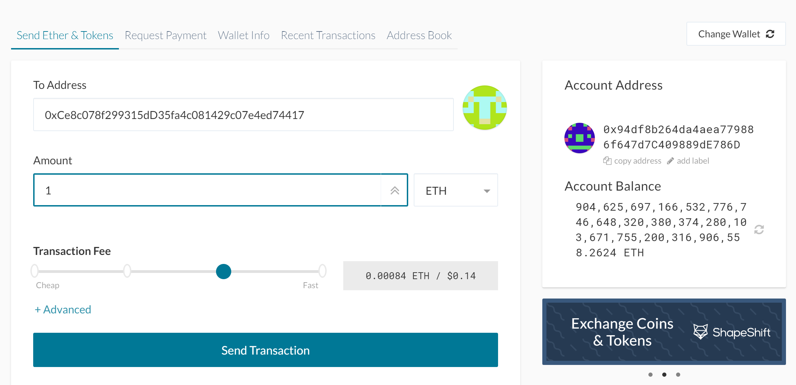

# Zbank network: Instruction to initate the network
# 1) Please see Go Ethereum Tools installation instruction below:
 ```bash
  1. Open your browser and navigate to the Go Ethereum Tools download page at https://geth.ethereum.org/downloads/

2. Scroll down to the "Stable Releases" section and proceed depending on your operating system.

 2.1. Installing in OS X.
 Click on the **"Geth & Tools 1.9.7"** to download the applications bundle archive.
 
 2.2. Installing in Windows.
 
 You need to know if you are running a `32 bit` or `64 bit` version of Microsoft Windows, if you are not sure about that, you can check your version following [these steps](https://support.microsoft.com/en-us/help/13443/windows-which-version-am-i-running).

 Depending on your Windows version, you should download the `32 bit` or `64 bit` version of the Go Ethereum Tools.

3. After downloading the tools archive, open your "Downloads" folder, and you will find a file named `geth-alltools-darwin-amd64-1.9.7-a718daa6.tar.gz` in OS X, and a file called `geth-alltools-windows-amd64-1.9.7-a718daa6.zip` in Windows. Note that the last numbers in the filename could vary depending on the last built available.

4. Decompress the archive in the location of your preference in your computer's hard drive, and rename the containing folder as `Blockchain-Tools`. We recommend using a location that can be easily accessed from the terminal window like the user's home directory.
  ```
  # 2) First you create accounts (also called wallet) by Geth before you create genesis block.
  
  # Open a terminal window, navigate to the Blockchain-Tools folder.

  ## Create the first node's data directory using the geth command and a couple of command line flags by running the following line in your terminal window (Git Bash in Windows):

    ./geth account new --datadir node1

  ## Repeat the same process for the second node by replacing the datadir parameter with the node2 folder.

    ./geth account new --datadir node2

  ## node1:
```bash
  $./geth account new --datadir node1
  Your new account is locked with a password. Please give a  password. Do not forget this password.
  Passphrase: passwordnode1 (for example)
  Repeat passphrase: passwordnode1
  Address: {public_key_address}
```
## node 2 :
```bash
  $./geth account new --datadir node2
  Your new account is locked with a password. Please give a password. Do not forget this password.
  Passphrase: passwordnode1 (for example)
  Repeat passphrase: passwordnode1
  Address: {public_key_address}
```
## After you create a new node account by geth in the terminal, the output will ask for your password and it will produce a public key address (visible) and hidden private key (automatically stored in keystore file). 

## Copy these two public key addresses from the terminal screen and save them in a text file. You cans store the addresses in text file by running the following line in your terminal:

```bash
$ echo 'Node1 public key address' >> accounts.txt
$ echo 'Node2 public key address' >> accounts.txt
```

## For each node, save your password in a file in a corresponding node folder to help ease the process for later on such as unlocking account.

```bash
$ echo 'passwordnode1' > node1/password.txt
$ echo 'passwordnode2' > node2/password.txt
```
---
# 3) In the terminal, Run puppeth by typing "./puppeth', name your network, and select the option to configure a new genesis block.

# 4) Choose the Clique (Proof of Authority) consensus algorithm 

# 5) Block time is the expected interval between two blocks. For ethereum, this is around 15 seconds. For Bitcoin, it is 10 minutes. You can simply press enter for default which is 15 seconds.
```bash
How many seconds should blocks take? (default = 15)
```
# 6) Paste both account addresses from the second step one at a time into the list of accounts to seal.

# 7) Paste them again in the list of accounts to pre-fund. There are no block rewards in PoA, so you'll need to pre-fund.

# 8) You can choose no for pre-funding the pre-compiled accounts (0x1 .. 0xff) with wei. This keeps the genesis cleaner.

# 9) Create a Chain ID/Network ID with any numeric value such as 888 
```bash
Specify your chain/network ID if you want an explicit one (default = random)
```
# 10) When you are back at the main menu, choose the "Manage existing genesis" option.

# 11) Choose the "Export genesis configurations". Then simply press enter for default. This will fail to create two of the files, but you only need networkname.json.


# 12) You can delete the networkname-harmony.json file.

# 13) Ctrl+C to quit puppeth

# 14) Initialize each node with the new networkname.json with geth.
```bash
./geth init networkname.json --datadir node1/
./geth init networkname.json --datadir node2/
```
---
# 15) Run the first node, unlock the account, enable mining, and the RPC flag. Only one node needs RPC enabled.
```bash
./geth --datadir node1/ --syncmode 'full' --networkid (any_numbers) --minerthreads 1 --unlock "node1_sealer_address" --password node1/password.txt --mine --allow-insecure-unlock 
```
### node1_sealer_address: By open up keystore file in a text editor, the address value can be found in 'UTC' text file. File path is node1/keystore/'UTC...etc'
 ### Notice that the last part of the file name in keystore/'UTC..address' is the address of your account 

---
# 16) Set a different peer port for the second node and use the first node's enode address as the bootnode flag.

# 17) Be sure to unlock the account and enable mining on the second node!
## While node1 is mining in a terminal, open a separate a terminal to run node2. In a separate terminal, navigate to the blockchain-tools directory, run the following command line:

```bash
./geth --datadir node2/ --syncmode 'full' --networkid (any_numbers) --rpc --unlock "node2_sealer_address" --password node2/password.txt --mine --allow-insecure-unlock --port 30304 --bootnodes "enode_address_from_node1" --ipcdisable
```
### node2_sealer_address: By open up keystore file in a text editor, the address value can be found in 'UTC' text file. File path is node2/keystore/'UTC...etc'

To retrieve enode address: Copy the entire `enode://` address (including the last `@address:port` segment) of the first node located in the `Started P2P Networking` line.


---
# 18) You should now see both nodes producing new blocks, congratulations!

# Geth Command Line flags:
```
--datadir value : Data directory for the databases and keystore. It will be node1 and node2. Example: --datadir node1/

--syncmode value: Blockchain sync mode ("fast", "full", or "light") (default: fast)
syncmode 'full' helps preventing the error Discarded Bad Propagated Block.

--networkid value : Network identifier. As defined in the genesis.json file. Please use the same id 

--rpc : Enable the HTTP-RPC server

--mine: Enable mining.

--miner.threads value: Number of CPU threads to use for mining (default: 0)

--unlock --password --mine tell the node to unlock this account, with the password in that file and to start mining (i.e. voting/sealing for Proof-of-Authority)

--allow-insecure-unlock : Allow insecure account unlocking when account-related RPCs are exposed by http

--port 30304 : Since the first node's sync port already took up 30303, we need to change this one to 30304 using --port.

--bootnodes value : tells your node at what address to find your bootnode. Comma separated enode URLs for P2P discovery bootstrap. In this case, enode address from node1 mining terminal.

--ipcdisable : Disable the IPC-RPC server
```

# Strongly recommend to check the Geth Command Line Interface documentation for more command line flags explanation. Link : [https://github.com/ethereum/go-ethereum/wiki/Command-Line-Options](geth)

---
# Connect MyCrypto to your network to send a transaction

## Use the MyCrypto GUI wallet to connect to the node with the exposed RPC port.

## You will need to use a custom network, and include the chain ID, and use ETH as the currency.

### 1. In the left pane on MyCrypto, click "Change Network" at the bottom left.


## seting network info
### 2. Click on "Add Custom Node", then add the custom network information that was set in the genesis.


### 3. Ensure that you scroll down to choose `Custom` in the "Network" setting to reveal more options like `Chain ID`:

### 4. The chain ID must match what you came up with earlier.

### 5. The URL is pointing to the default RPC port on your local machine. Everyone should use this same URL: `http://127.0.0.1:8545`


### 6. Select Keystore File to open up your wallet. Click "SELECT WALLET FILE" and navigate to node1/keystore file (the one start with UTC-....” and is also where your encrypted private key is stored, then type your node1 password (you had created this password earlier when you first create accounts by Geth) 
### We need to select node1 keystore file because node1 already has RPC exposed port.


# We're going to send a transaction to ourselves to test it out. Follow the next steps.

* Copy the pre-fund address into the "To Address" field, then fill in an arbitrary amount of ETH.



* Confirm the transaction by clicking "Send Transaction", and the "Send" button in the pop-up window.


* Click the `Check TX Status` when the green message pops up, confirm the logout:


* You should see the transaction go from `Pending` to `Successful` in around the same blocktime you set in the genesis.

* You can click the `Check TX Status` button to update the status.


# Congratulations, that was the first transaction send on this blockchain network! 
